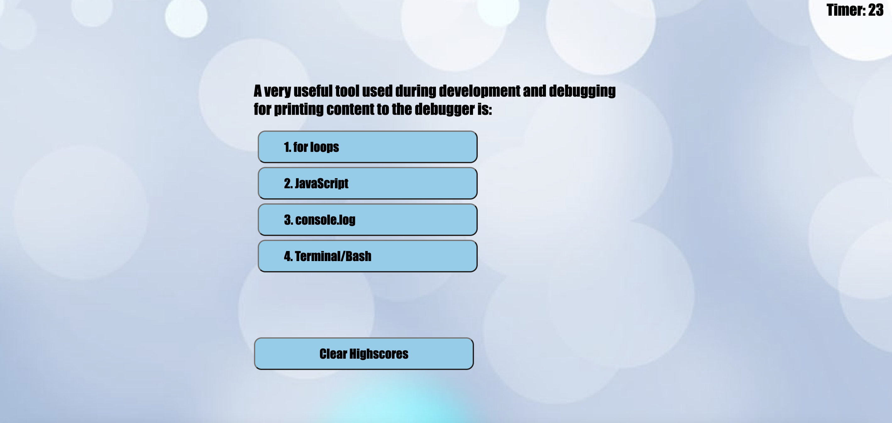
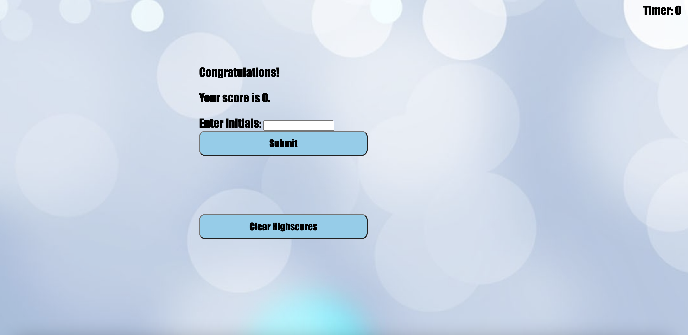

# Code Quiz Challenge

Description

This challenge is to create a quiz. 
The purpose of this is to use JavaScript and Web APIs to generate a quiz.

Screenshot

My Links:

https://rtleib.github.io/code-quiz-challenge-04/

https://github.com/rtleib/code-quiz-challenge-04